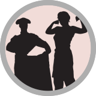
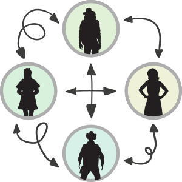



## Post-doctoral scientists

Looking for post-docs?

## Ph.D. Students

If you are interested in doing a rotation in our lab, please don't hesitate to get in touch.

## And More...

If you are an undergraduate student or an intern who is looking for a challenging but potentially fruitful project related to ...

Do you have other suggestions? Write to [us]({{site.url}}/people/)!

