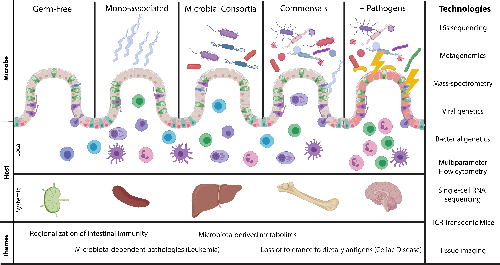
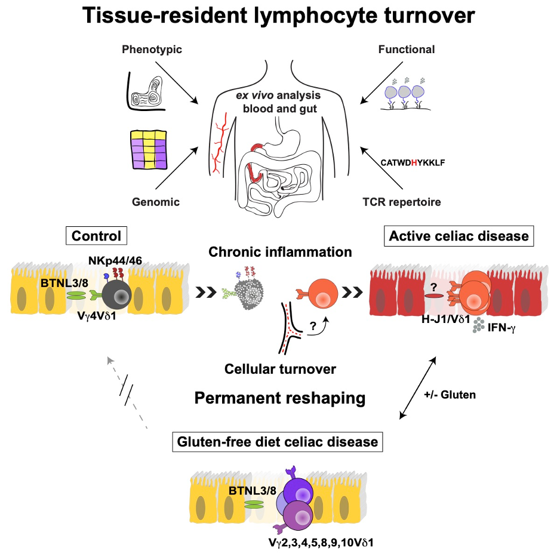
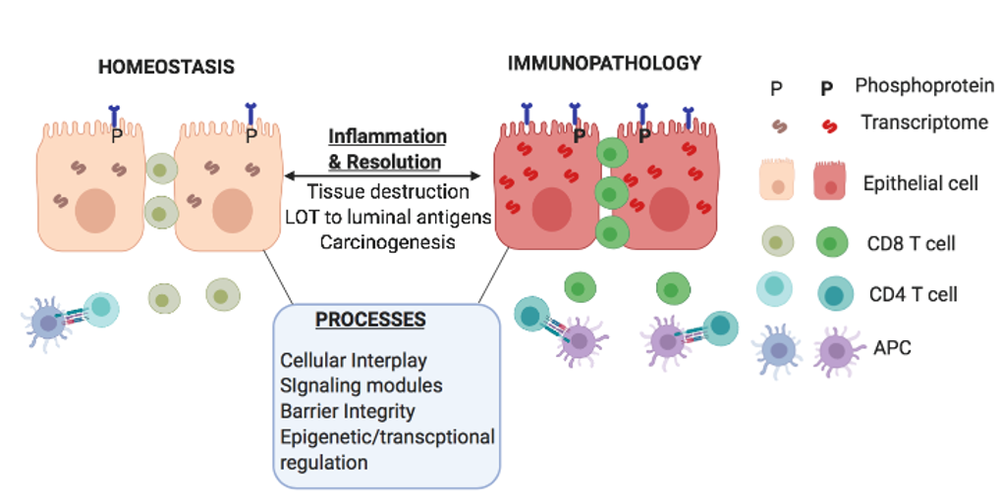



## Applying human immunology and genomics to the study of tissue immunity and disease

Our intimate understanding of the inner workings of the immune system can be mostly traced to studies conducted in mice. These studies have been invaluable but in order to truly understand complex immune disorders where specific tissues are impacted and to build relevant mouse models with the goal of developing novel treatments we must improve our knowledge of the human immune system in health and disease. Our lab is dedicated to this endeavor and human work in the lab has focused on better understanding questions surrounding tissue immunity at mucosal sites such as the intestine. Specifically, we are interested in understanding the regulation, function, and differentiation of tissue-resident lymphocytes (Mayassi T. et al. Cell. 2019), the interaction between tissues and immune cells (mala, bnz2, Bertrand immunity), the mechanisms underlying tissue destruction (nature papers), and more recently the disruption of host microbiome interactions in carcinogenesis. As a result, our team has been able to make important progress in the understanding of autoimmune disorders including rheumatoid arthritis, type I diabetes, and celiac disease (CeD) as well as inflammatory bowel disorders such as primary sclerosing cholangitis (PSC) associated pathologies while at the same time making big picture basic immunology discoveries.

The strengths of our lab make this possible via:

* **Dedicated personnel that allow for continuous access to patient samples** by screening through 400 patients weekly to find the most specific and applicable samples to each individual study. With nationally funded clinical trials, clinical research coordinators and technicians manage trial work and work alongside physicians daily to consent patients and acquire samples needed for lab analysis. These same individuals perform intensive chart reviews, histology reviews, and diagnostic clarifications in collaboration with physicians from multiple specialties. Their role provides our lab with a plethora of samples needed for rigorous analysis of disease pathogenesis.

* **Collaborating with practicing physicians at the University of Chicago Medicine system** allows us to integrate clinical data and outcomes with the primary research data generated in our lab. This interaction is critical to the interpretation of our data, which is why we have established relationships with specific physicians who are heavily involved in specific projects.

* **International and national collaborations** give us access to unique patient cohorts, tissue samples, and expertise.

* **Implementation of multidisciplinary approaches** provides a comprehensive understanding of the diseases we study and also reveals novel aspects of disease and tissue immunity in need of further investigation. Additionally, multidisciplinary approaches to tissue immunity reveals the nuances of autoimmunity which helps better understand the natural heterogeneity within disease groups and can allow for sub-phenotyping of patients to better understand their outcomes and responses to medication. The multi-disciplinary approaches that we use include: genomics, transcriptomics (single cell, cell-type specific, and tissue level), metagenomics, metabolomics, and cell phenotyping.

* **Our ability to work with limited quantities of tissue** maximizes the amount of information we can derive from a single individual. From 4-6 tissue biopsies we can perform multiple ex vivo and in vitro experiments, including single cell and low-cell number RNAseq, generation of primary cell lines, activation assays, immunohistochemistry, ligand assays, stimulations, flow cytometry, and adaptive immune repertoire analysis. 

* **State of the art technology** permitting us to work with limited quantities of tissue samples. These technologies include single cell RNAseq (10x Chromium, Smart-seq2), 30+ color flow cytometry (Cytek Aurora), and a 6-population/28-color flow cytometry sorter.

{:.center-img .width-50}

An example of implementing all of these pieces to address a basic immunology question about tissue-resident lymphocytes comes from one of our recent studies where we focused on uncovering the mystery of human tissue-resident intraepithelial γδ T cells and their enigmatic expansion in the context of both the active and treated states of CeD. By studying these cells directly ex vivo using a combination of techniques including high dimensional flow cytometry to profile surface expression of various immune parameters, activation assays, T cell receptor (TCR) repertoire sequencing, RNA-sequencing, and reactivity assays in collaboration with the labs of David Price from Cardiff University and Jamie Rossjohn from Monash University we were able to uncover γδ T cells in healthy individuals take on an innate-like phenotype characterized by the unique expression of activating natural cytotoxicity receptors (NCRs) and a semi-invariant T cell receptor TCR expressing Vδ1Vγ4 gene segments. This heathy subset was displaced in patients with active CeD in favor of newly recruited Vδ1+ intraepithelial lymphocytes (IELs) that produce IFN-γ in a gluten dependent manner and whose TCRs showed evidence of adaptively driven expansions with the emergence of a non-germline encoded TCR motif shared across individuals. Importantly, although a gluten-free diet restores the heathy architecture of the intestine, the healthy subset of γδ IELs does not recover, thus leaving the compartment permanently devoid of these unique innate-like cells. Furthermore, the production of IFN-γ by Vδ1+ IELs only when patients eat gluten is compatible with them playing a pathogenic role in CeD. The identification of the specificity of expanded γδ IELs in CeD patients in the focus of ongoing studies and will further increase our understanding of their role in the disease.

{:.center-img .width-50}

In a recent study we utilized our ability to generate short-term primary T cell lines from ex vivo sorted intestinal T cells to study the efficacy of an inhibitor (BNZ-2) that blocks signaling by the cytokines IL-15 and IL-21, both of which are upregulated in CeD. These in vitro studies allowed us to uncover the transcriptional consequences of activating intestinal T cells with either IL-15 or IL-21 as well as the two cytokines combined using RNA-sequencing. In addition to the unique signatures associated with each cytokine alone, we observed a unique set of genes induced by the combination suggesting a synergy between these two cytokines. Furthermore, BNZ-2 was able to successful prevent the induction of these programs in primary T cell lines as well as whole biopsies in the presence of IL-15 and IL-21 putting it forward as a potential therapeutic for treatment of chronic activation of intestinal T cells in CeD. 

In an ongoing study on primary sclerolsing cholangitis (PSC), we are investigating the contributions of the immune system to the intestinal pathologies observed in these patients. Upwards of 90% of patients with PSC have intestinal inflammation that is classified as inflammatory bowel disease (IBD). Prior to our investigation, the colonic inflammation observed in PSC was thought to be identical in nature to that of IBD inflammation. The data we derived from transcriptional analysis, cell phenotyping, and metagenomics now suggests that PSC-associated colonic inflammation is fundamentally different than IBD-associated inflammation. Unlike IBD-associated inflammation, PSC-associated inflammation is characterized by an extreme infiltration of IgG plasma cells and a tissue IL-17 signaling signature. Repertoire analysis of these cell types demonstrates clonal expansion, which is suggestive of antigen drive. Interestingly, the presence of these clonally expanded cells is associated with and predicts the development of colorectal cancer amongst PSC patients. We are currently working on identifying the driving antigen using monoclonal antibodies derived from patient clonally expanded IgG plasma cells, with the hopes of therapeutic targets for the prevention of colorectal cancer in PSC. Additionally, this data will contribute to our understanding of ways in which the adaptive immune system and its interaction with the microbiota can lead to cancer and other pathologies.

## Tissue immunity in health and disease

The gastrointestinal tract is constantly exposed to microbes, food and environmental agents. A significant proportion of our physiology and immune system has developed to keep this intricate barrier healthy. Unsurprisingly, breakdown in this barrier is frequent and associated with many inflammatory diseases and cancer. A major focus area of the lab is studying how crosstalk between intestinal epithelial cells (IECs) and the immune system maintains homeostasis and how dysregulation of these processes promotes inflammation and cancer.

Some of the overarching questions our lab is trying to address include uncovering regulatory processes that mediate immune surveillance and tissue destruction underlying autoimmune disorders. To answer these questions, our lab uses Celiac Disease (CeD) as a model disorder. CeD is a complex, autoimmune-like inflammatory disorder of the small intestine driven by the ingestion of dietary gluten in genetically-suspectable HLA-DQ2 or HLA-DQ8 individuals. CeD provides a clear example of what happens when an immune response meant to protect a barrier site becomes misdirected against self.  Gluten ingestion in individuals with CeD induces an immune response against self that results in the killing of one’s own intestinal epithelial cells (IECs). Using previous observations in human CeD patients, our lab has recently reverse-engineered the first transgenic mouse model of CeD (CeD-tg) that recapitulates all of the major features of CeD in humans. This model allows us to investigate the interplay of soluble and cellular mediators that promote inflammation and tissue destruction. More specifically, it will enable the study of the cross talk between gluten-specific CD4 T cells, IE-CTLs and IECs during CeD pathogenesis, and how these come together to drive villous atrophy and a loss of oral tolerance to gluten.  

Another project in the lab is focused on elucidating the role of IECs in directing immune responses. IECs serve as targets for destruction by cytotoxic T cells during certain autoimmune conditions like CeD. However, emerging evidence shows that IECs are immunologically active and can also orchestrate an immune response by secreting cytokines and chemokines and expressing ligands and receptors for immune cells. We are focusing on key signaling nodes downstream of epithelial pattern-recognition receptors that are activated during inflammatory bowel diseases. Our results show that epithelial signaling modulates T cell response during experimental colitis, which in turn regulates the restitution of the epithelial barrier. The immune priming provided by the epithelium also modulates the tone and degree of immune responses distal to the gastrointestinal tract. Therefore, modulation of the epithelial cells by diet or targeted agents can help in alleviating both intestinal and extra-intestinal and immune disorders.  

Epigenetic regulation provides heritable marks that poise the immune response to be responsive, adaptable and to generate memory to past insults. Ten Eleven Translocation (TET) enzymes (TET 1-3) are executioners of epigenetic imprinting via DNA demethylation and are critically involved in biological processes such as cell fate, and plasticity. Preleukemic myeloproliferative disorder, consequent to intestinal permeability and systemic microbial translocation is observed in mice deficient in TET2. This highlights the significance and impact of intestinal immunity on systemic manifestations. Epigenetic mechanisms in the IECs and innate immune cells that impact cellular crosstalk, and perpetuate the immune dysfunction are areas of exploration in the lab.

## Microbes as the drivers of host immunity

Our lab is intimately interested in the field of microbe host interaction and the relationships of commensal or pathogenic microbes on shaping the host immune response in homeostasis and disease. Furthermore, we are interested in conceptualizing how commensal microbes can become pathobionts under certain genetic contexts and have adverse consequences for the host. We are intrigued on how tolerance is established in the intestine and how microbes have the capacity to establish or break tolerance and lead to disease. We are also exploring the physiologic function of bacteria or viruses on the host and are using viral gene reassortants, in collaboration with the Dermody lab, and bacterial metabolomic reconstructions to discover systemic metabolites and their consequences. To address these questions, our lab utilizes numerous genetic tools involved in the creation of transgenic mice in collaboration with the University of Chicago Transgenic Mouse Core. The use of germ free mice in collaboration with Gnotobiotic Mouse Core. We also use cutting edge technologies such as next gen sequencing, high resolution mass spectrometry in collaboration with the Pamer lab, complex 30 color flow cytometry. These studies will advance the understanding of multifactorial autoimmune diseases such as celiac disease, inflammatory bowel disease, and various cancers. 

We are interested in understanding regionalization of the intestinal immune response and how colonization of specific commensal microbes contribute to shaping the mucosal immune response. In addition we are intrigued on how regionalization of intestinal immunity is important for contributing to health and disease. 

Gut microbial metabolites play a major role in regulating host homeostasis but are also associated with medical conditions such as obesity, autism spectrum disorder or inflammatory bowel syndrome. To investigate the fate and impact of microbial metabolites beyond the gut environment, we use a combination of mass spectrometric approaches to trace and identify microbially produced compounds throughout the host body. We are especially interested in deciphering effects of metabolites produced by the microbiota of the small intestine during healthy versus inflammatory conditions. 

The microbiota has also been implicated in complex systemic disorders, such as cancer. Our lab has demonstrated how host genetics and microbial signals collectively impact the progression of myeloproliferative disease in mice. We specifically study how inflammatory pathways secondary to Tet2-deficiency, a gene that is readily somatically mutated in elderly populations, promote pre-malignant progression using murine models as well as primary human samples.

Several epidemiological studies have implicated viral infections not only in the development of Celiac Disease (CD) but also of autoimmune disorders such as type-1 diabetes. However, the mechanisms by which viruses induce an inflammatory response against dietary and self-antigens remain poorly understood. Using reovirus as a model enteric pathogen, we aim to investigate the dynamic of the host-viral interaction by means of flow cytometry combined with single cell sequencing and viral reassortants. Our approach will allow us to deepen our understanding of virus induced immunopathology in the gut and regulation of immune responses against dietary antigens. 

If you have any questions, please don't hesitate to [write to us]({{site.url}}/people/).

